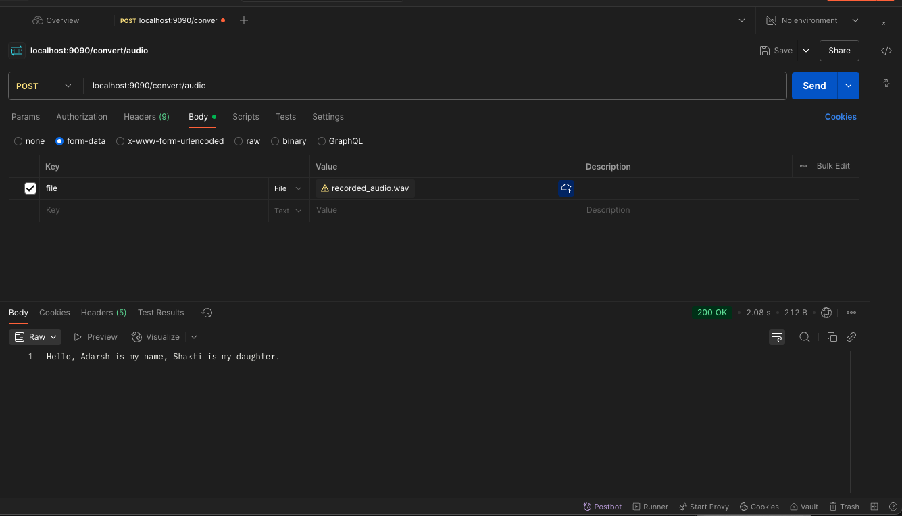

# springboot-openai-speech-to-text


* curl --location 'localhost:9090/convert/audio' \
--form 'file=@"/Volumes/Adarsh-Home/EDUCATION/GITHUB/espark-project/java-audiocapture-mic/recorded_audio.wav"'

```
{"text":"Hello, Adarsh is my name, Shakti is my daughter.","usage":{"type":"duration","seconds":12}}
```
