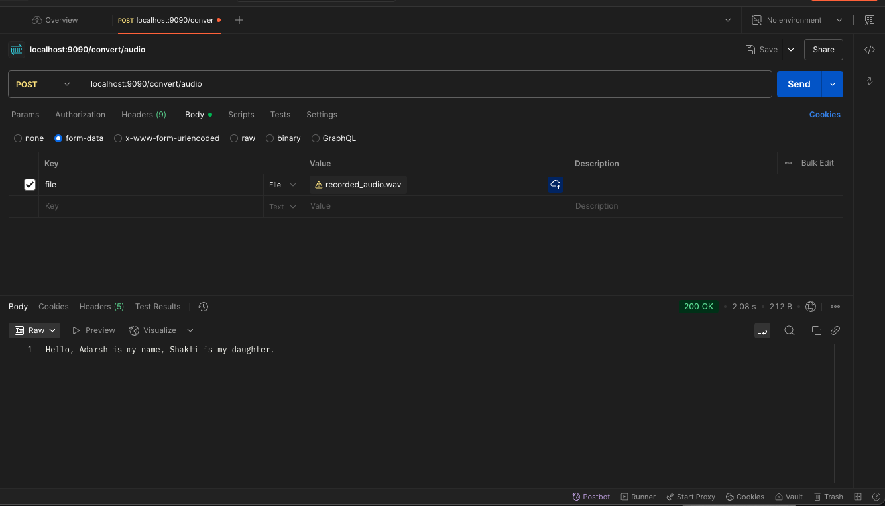

# springboot-openai-speech-to-text


* curl --location 'localhost:9090/convert/audio' \
--form 'file=@"/Volumes/Adarsh-Home/EDUCATION/GITHUB/espark-project/java-audiocapture-mic/recorded_audio.wav"'

```
{"text":"Hello, Adarsh is my name, Shakti is my daughter.","usage":{"type":"duration","seconds":12}}
```
# openai-text-to-speech

* curl --location 'localhost:9090/convert/text/audio' \
  --header 'Content-Type: application/json' \
  --header 'Accept: application/json' \
  --data '{
  "input":"hi my name is Adarsh radha is my wife and shakti is my daughter",
  "requestId":"9626af94-d0d5-4549-aa57-3254a10c823a"
  }'

* response 
```
Speech Audio was saved to => c50893d2-0783-41e7-a6cb-20a25824d880_output_1752854299166.mp3
```